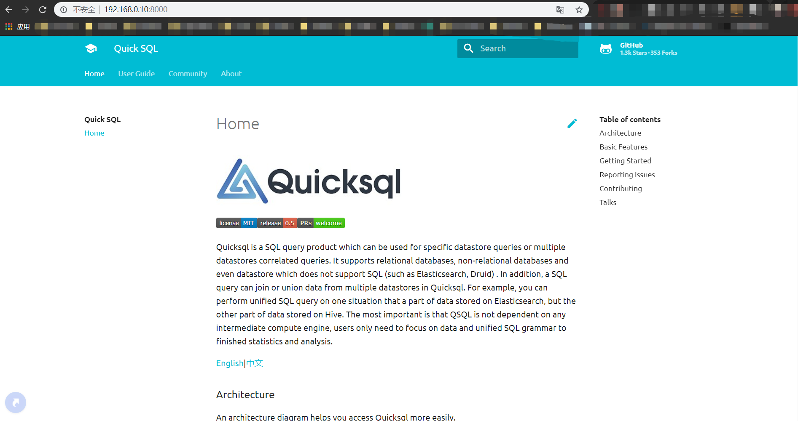

[English](./contribution-docs.md)|[中文](../zh/community/contribution-docs.md)

# Contributing documents

## Installing Python
Install [Python](https://www.python.org/) or [Anaconda](https://www.anaconda.com/).

[MkDocs](https://www.mkdocs.org/) supports Python versions 2.7, 3.4, 3.5, 3.6, 3.7 and pypy.

## Installing pip 
- If you're using a recent version of Python, the Python package manager, pip, 
is most likely installed by default. However, you may need to upgrade pip to the lasted version:

```
pip install --upgrade pip
```

- If you need to install pip for the first time, download get-pip.py. 
Then run the following command to install it:

```shell
curl https://bootstrap.pypa.io/get-pip.py -o get-pip.py
python get-pip.py
```

## Installing MkDocs and dependencies
Install the mkdocs package and dependencies using pip:

```shell
pip install mkdocs
pip install mkdocs-material
pip install pygments
pip install pymdown-extensions
```

You should now have the mkdocs command installed on your system. Run `mkdocs
--version` to check that everything worked okay.

## Run mkdocs
 
```shell
mkdocs serve || mkdocs serve -a IP:port
```

Open browser `http://127.0.0.1:8000`



## Write markdown documents
- Create a new `.md` file in the `/docs directory`,
Chinese docs under `/docs/zh`.

- Edit `mkdocs.yml` and add pages.  [Tutorial](https://www.mkdocs.org/#adding-pages)

```yml
nav:
  - Home: 'index.md'
  - User Guide:
      - 'JDBC Doc': 'user-guide/jdbc.md'
      - 'Build Doc': 'user-guide/build.md'
      - 'API Doc': 'user-guide/api.md'
  - Community:
      - Channel: 'community.md'
      - Contribution:
        - Code: 'contribution-code.md'
        - Docs: 'contribution-docs.md'
  - About:
      - 'License': 'about/license.md'
      - 'Release Notes': 'about/release-notes.md'
```

## Commit

Push your all changes and open a PR. 