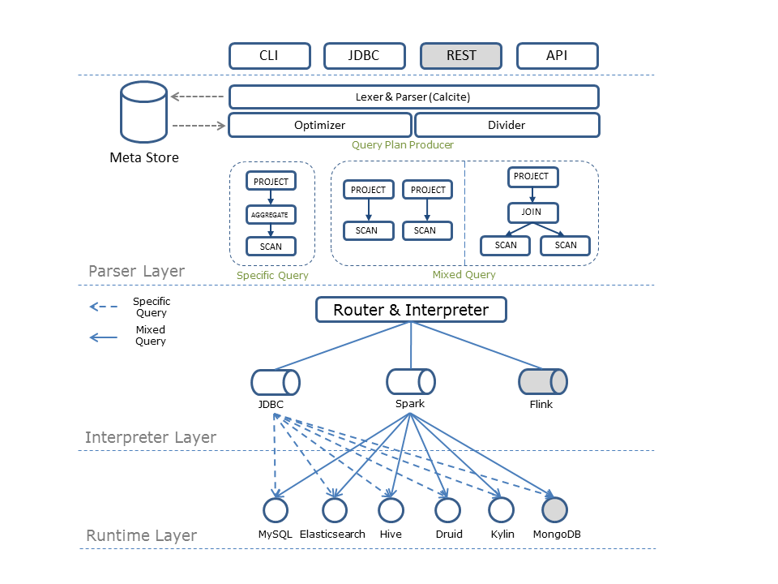

[English](../index.md)|[中文](./index.md)


[](./LICENSE)[]()[]()

QSQL是以SQL进行单一、混合查询的一款产品。QSQL支持标准SQL语言（SQL-2003）；QSQL支持查询关系型数据库、NoSQL式数据库、原生不支持SQL查询的存储（如ES、Druid），及借助中间计算引擎实现混合查询。QSQL最大的特点是独立于计算引擎、存储引擎本身，如此用户只需要关注于QSQL语法以及数据本身，就可完成数据计算、统计以及分析。


## 架构设计



QSQL包含三层结构：

- 语法解析层：负责SQL语句的解析、校验、优化、混算SQL的切分以及最终生成Query Plan；

- 计算引擎层：负责Query Plan路由到具体的执行计划中，将Query Plan解释为具体的执行引擎可识别的语言；
- 数据存储层：负责数据的提取、存储；

## 基本用法

在大多数情况下，我们希望使用一种语言进行数据分析，并且不想考虑与数据分析无关的事情，Quicksql为此而生。

 Quicksql的目标是提供三个功能： 

***1. 将所有结构化数据查询统一为SQL语法***

- **都用SQL**

在Quicksql中，你可以这样查询Elasticsearch:

```sql
SELECT state, pop FROM geo_mapping WHERE state = 'CA' ORDER BY state
```

甚至像这样进行聚合查询:

```sql
SELECT approx_count_distinct(city), state FROM geo_mapping GROUP BY state LIMIT 10
```

- **屏蔽方言**

在过去，查询时需要将相同的语义语句转换为不同引擎的方言，例如：

```sql
SELECT * FROM geo_mapping 						-- MySQL Dialect
LIMIT 10 OFFSET 10 								
```

```sql
SELECT * FROM geo_mapping 						-- Oracle Dialect
OFFSET 10 ROWS FETCH NEXT 10 ROWS ONLY 			
```

在Quicksql中，关系数据库不再有方言的概念。 你可以使用Quicksql的语法来查询任何引擎，就像这样：

```sql
SELECT * FROM geo_mapping LIMIT 10 OFFSET 10	-- Run Anywhere
```

***2. 屏蔽不同数据源之间的隔离性***

考虑一种情况，你希望关联位于不同引擎中的表或不在同一集群中的表，您可能会遇到麻烦。 

但是，在Quicksql中，您可以这样查询：

```sql
SELECT * FROM 
	(SELECT * FROM es_raw.profile AS profile	//index.tpye on Elasticsearch 
		WHERE note IS NOT NULL )AS es_profile
INNER JOIN 
	(SELECT * FROM hive_db.employee AS emp	//database.table on Hive
	INNER JOIN hive_db.action AS act	//database.table on Hive
	ON emp.name = act.name) AS tmp 
ON es_profile.prefer = tmp.prefer
```
下图展示了Quicksql对于联邦查询的优化流程：


***3. 选择最合适的方式来执行查询***

涉及多个引擎的查询可以以很多种方式执行，作为一个长期的计划，Quicksql希望结合每个引擎的优势来找到最合适的一个。

## 贡献代码

我们非常欢迎贡献代码。

如果需要提交的代码比较多，可以先和我们谈谈！记录一条[Issues]。这对双方达成共识是有帮助的。

Fork QSQL GitHub库，并为您的提交创建一个分支。

开发您的代码和测试用例，运行测试用例来验证您的修改是正确的。

提交代码到您的分支上。

如果您的更改有多个提交，请使用`git rebase -i master`将它们压缩为单个提交，并将代码更新到主线上的最新版本。

然后将您的提交推送到GitHub上，并从您的分支创建一个pull请求到QSQL主分支，committer将会检查您的更改。

在提交之后，pull request可能需要更新，原因如下：

- 您在提交pull request之后发现了一个问题
- reviewer要求进一步修改

为了更新pull请求，需要在分支中提交更改，然后将提交推到GitHub。我们鼓励您在现有提交的基础上使用常规（非基于重新构建）提交。

当将更改推送到GitHub时，您应该避免使用`--force`参数及其替代方法。您可以选择在某些条件下强制推行您的更改：

- 最近一次的pull request的提交在10分钟之内，并且没有关于它的未决讨论
- reviewer明确要求您执行一些需要使用`--force`选项的修改

