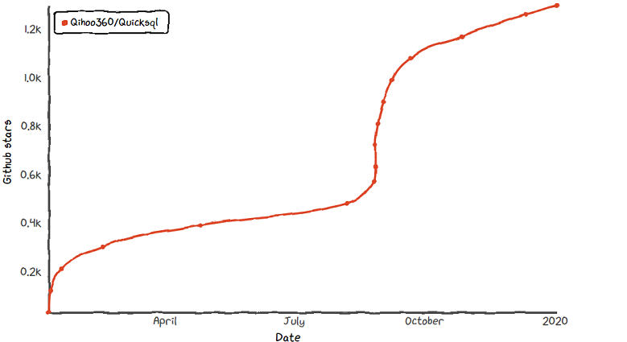
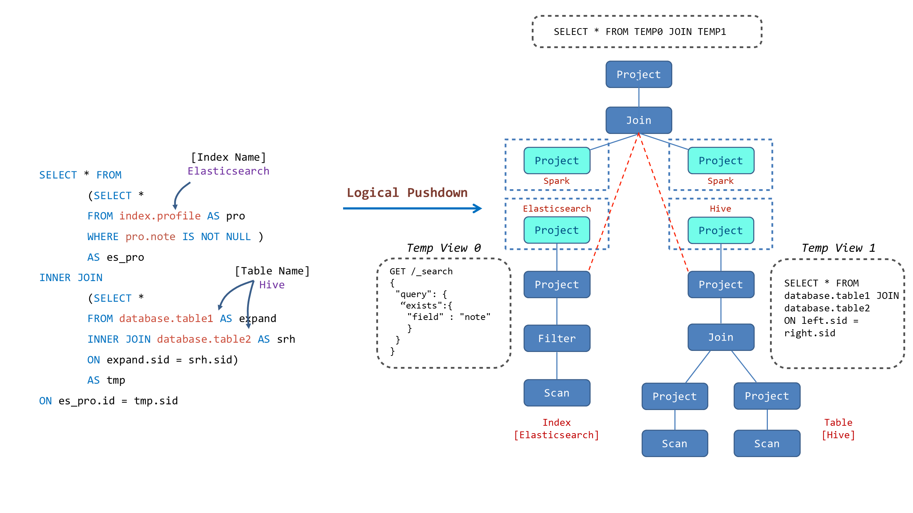

[English](../index.md)|[中文](./index.md)


Quicksql是一款跨计算引擎的统一联邦查询中间件，用户可以使用标准SQL语法对各类数据源进行联合分析查询。其目标是构建实时\离线全数据源统一的数据处理范式，屏蔽底层物理存储和计算层，最大化业务处理数据的效率。同时能够提供给开发人员可插拔接口，由开发人员自行对接新数据源。

[](https://star-history.t9t.io/#Qihoo360/Quicksql)

## 功能特性：

- 支持8种数据源查询：Hive, MySQL, Kylin, Elasticsearch, Oracle, MongoDB，PostgreSQL，GBase-8s；
- 支持Spark、Flink双计算引擎；
- 支持基础CLI命令行查询和JDBC远程连接查询；
- JDBC类型数据源可通过YAML配置快速接入，无需修改代码；
- 提供方言/语法对接模板，支持用户对新数据源的语法自定义；
- 提供元数据采集功能，批量拉取预置元数据；
- 支持落地HDFS，支持可配置的异步响应机制；

## 架构设计


Quicksql 包含三层结构：

- 语法解析层：负责 SQL 语句的解析、校验、优化、混算 SQL 的切分以及最终生成 Query Plan；

- 计算引擎层：负责 Query Plan 路由到具体的执行计划中，将 Query Plan 解释为具体的执行引擎可识别的语言；

- 数据存储层：负责数据的提取、存储；

## 基本用法

在大多数情况下，我们希望使用一种语言进行数据分析，并且不想考虑与数据分析无关的事情，Quicksql 为此而生。

Quicksql 的目标是提供三个功能： 

***1. 将所有结构化数据查询统一为 SQL 语法***

- **都用 SQL **

在 Quicksql 中，你可以这样查询 Elasticsearch:

```sql
SELECT state, pop FROM geo_mapping WHERE state = 'CA' ORDER BY state
```

甚至像这样进行聚合查询:

```sql
SELECT approx_count_distinct(city), state FROM geo_mapping GROUP BY state LIMIT 10
```

- **屏蔽方言**

在过去，查询时需要将相同的语义语句转换为不同引擎的方言，例如：

```sql
SELECT * FROM geo_mapping 						-- MySQL Dialect
LIMIT 10 OFFSET 10 								
```

```sql
SELECT * FROM geo_mapping 						-- Oracle Dialect
OFFSET 10 ROWS FETCH NEXT 10 ROWS ONLY 			
```

在 Quicksql 中，关系数据库不再有方言的概念。 你可以使用 Quicksql 的语法来查询任何引擎，就像这样：

```sql
SELECT * FROM geo_mapping LIMIT 10 OFFSET 10	-- Run Anywhere
```

***2. 屏蔽不同数据源之间的隔离性***

考虑一种情况，你希望关联位于不同引擎中的表或不在同一集群中的表，您可能会遇到麻烦。 

但是，在 Quicksql 中，您可以这样查询：

```sql
SELECT * FROM 
	(SELECT * FROM es_raw.profile AS profile	//index.tpye on Elasticsearch 
		WHERE note IS NOT NULL )AS es_profile
INNER JOIN 
	(SELECT * FROM hive_db.employee AS emp	//database.table on Hive
	INNER JOIN hive_db.action AS act	//database.table on Hive
	ON emp.name = act.name) AS tmp 
ON es_profile.prefer = tmp.prefer
```
下图展示了 Quicksql 对于联邦查询的优化流程：



***3. 选择最合适的方式来执行查询***

涉及多个引擎的查询可以以很多种方式执行，作为一个长期的计划，Quicksql 希望结合每个引擎的优势来找到最合适的一个。

## 贡献代码

我们非常欢迎贡献代码。

如果需要提交的代码比较多，可以先和我们谈谈！记录一条[Issues]。这对双方达成共识是有帮助的。

Fork Quicksql GitHub 库，并为您的提交创建一个分支。

开发您的代码和测试用例，运行测试用例来验证您的修改是正确的。

提交代码到您的分支上。

如果您的更改有多个提交，请使用`git rebase -i master`将它们压缩为单个提交，并将代码更新到主线上的最新版本。

然后将您的提交推送到 GitHub 上，并从您的分支创建一个 pull 请求到 Quicksql 主分支，committer 将会检查您的更改。

在提交之后，pull request 可能需要更新，原因如下：

- 您在提交 pull request 之后发现了一个问题

- reviewer 要求进一步修改

为了更新 pull 请求，需要在分支中提交更改，然后将提交推到 GitHub。我们鼓励您在现有提交的基础上使用常规（非基于重新构建）提交。

当将更改推送到 GitHub 时，您应该避免使用`--force`参数及其替代方法。您可以选择在某些条件下强制推行您的更改：

- 最近一次的 pull request 的提交在 10 分钟之内，并且没有关于它的未决讨论

- reviewer明确要求您执行一些需要使用`--force`选项的修改

## 加入我们

[](https://join.slack.com/t/quicksql/shared_invite/enQtODkwMzM0Njc3NTExLWQxNjRlY2M5YTlkMTk4OTM2YzhjMjUxYTUyN2VlNzJlNzQwM2E4YjkxNzA4MDllODg5NWUxNDY4MTMyMzczMWI)
[](https://github.com/qihoo360/Quicksql/issues)
[](https://jq.qq.com/?_wv=1027&k=5782R6F)

