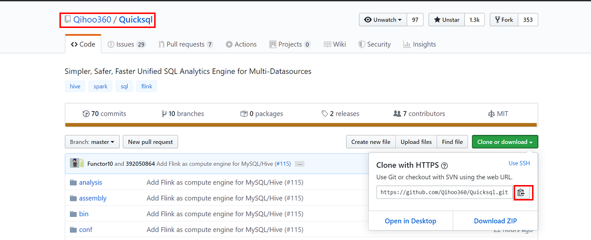
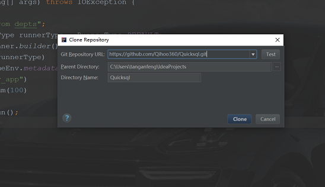
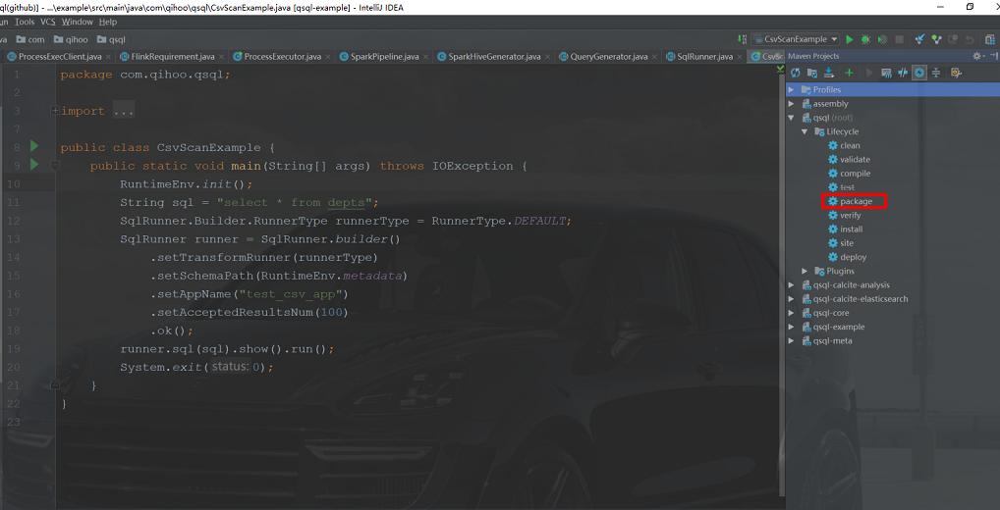
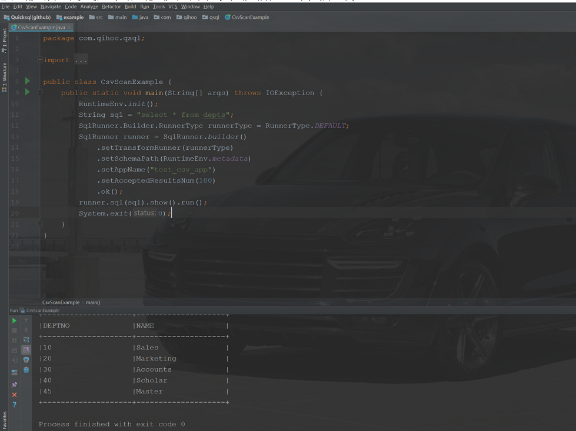
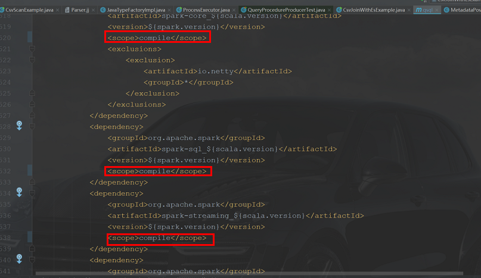
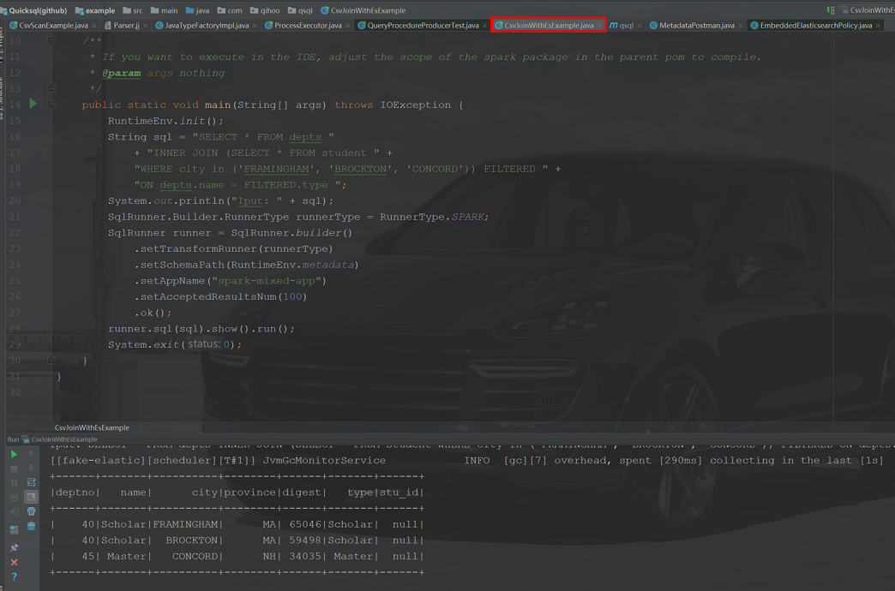

[English](../../reference/develop.md)|[中文](./develop.md)

# QuickSQL 开发

(1)  第一步找到 QuickSQL 项目 https://github.com/Qihoo360/Quicksql 

（2）第二步 down 到本地 idea

(3) 第三步本地编译及打包

（4）第四步本地运行 example

ps:混合查询测试

由于本地测试需要使用 spark 相关环境，需要修改父 pom 下 spark 的 scope 为 compile 形式

(5) 第五步修改 pom

（6）第六步运行混查 example

